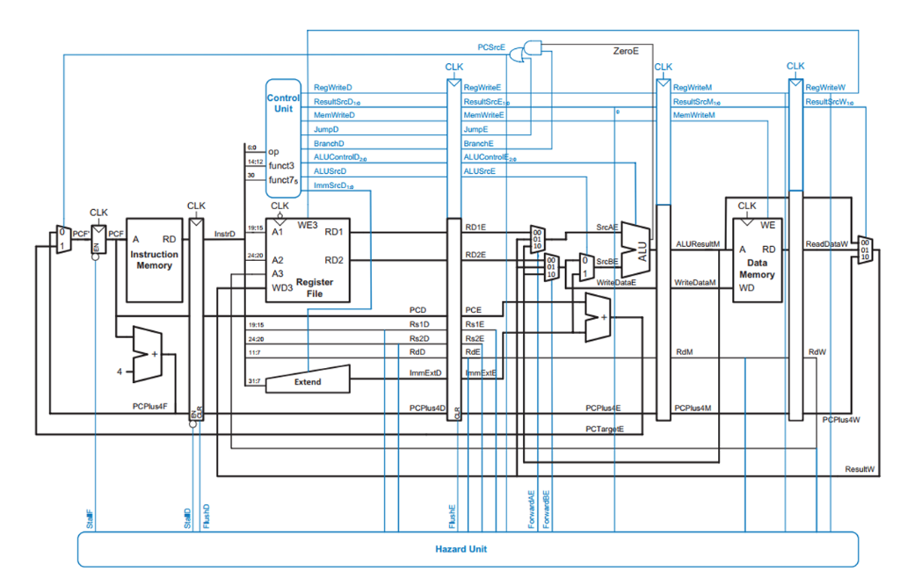
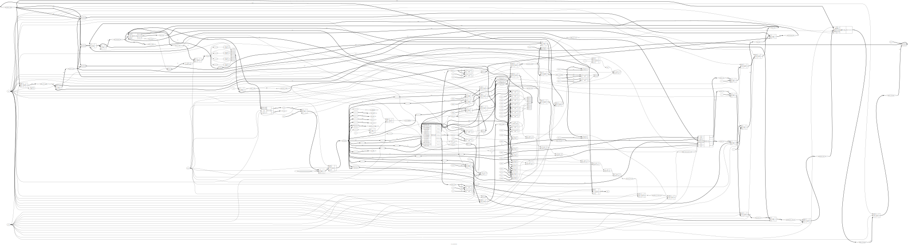
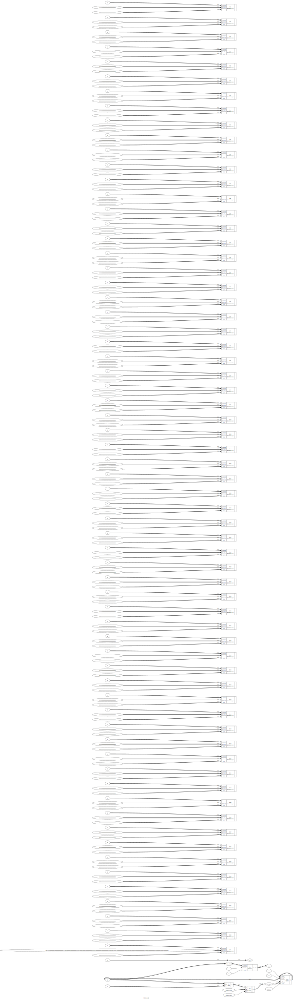
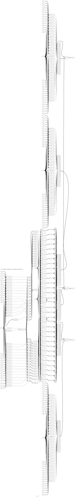
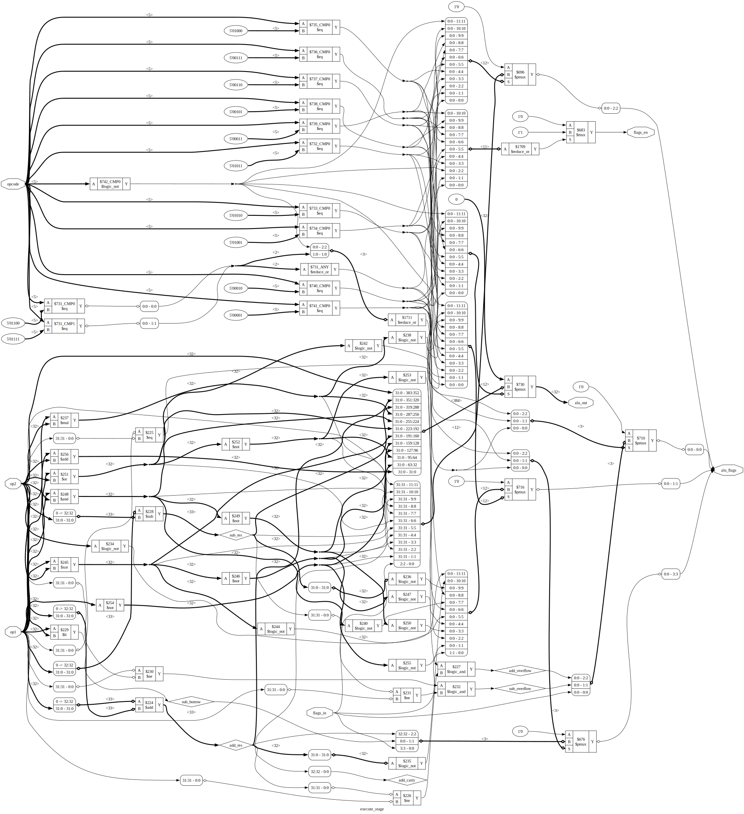
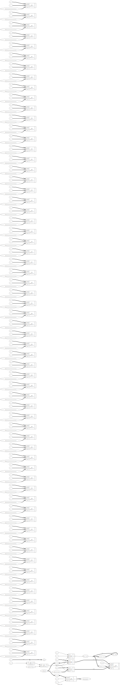
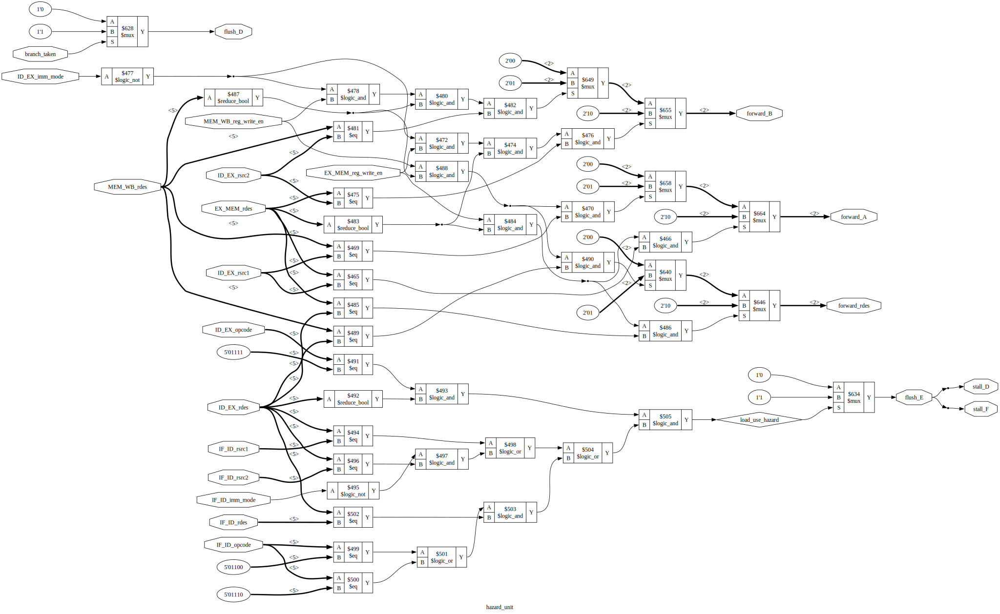

# Custom 32-Bit Pipelined RISC Processor

An implementation of a custom 32-bit pipelined RISC processor designed in Verilog. The processor features a classic 5-stage pipeline, synchronous reset, a hazard detection unit to handle data/control hazards, and forwarding paths to minimize stalls.

---

## 📐 Architecture & Pipeline Overview

The processor operates on a **5-stage pipeline** designed to execute instruction sets concurrently across distinct hardware stages:

```
[IF: Instruction Fetch] ──> [ID: Instruction Decode] ──> [EX: Execute] ──> [MEM: Memory] ──> [WB: Writeback]
                                     ▲                         │
                                     │     [Hazard Unit]       │
                                     └────── Forwarding ───────┘
```

1. **Instruction Fetch (IF):** Generates the next Program Counter (PC) address (supporting absolute branching) and reads instructions combinational-style from instruction memory.
2. **Instruction Decode (ID):** Decodes instruction operands, decodes register source/destination addresses, and reads values from the $32 \times 32$-bit register file.
3. **Execute (EX):** Utilizes an Arithmetic Logic Unit (ALU) to perform arithmetic, logic, and comparison operations. Also resolves branch conditions (Carry, Sign, Zero, Overflow) and determines if a branch should be taken.
4. **Memory Stage (MEM):** Interacts with a synchronous data memory to store register values (`OP_STOREREG`) or read stored data (`OP_SENDREG`).
5. **Writeback (WB):** Routes data (either ALU output, external `din`, or memory `LMD`) back to the register file.

---

## 🚦 Hazard Detection & Data Forwarding

To ensure high performance and prevent data/control conflicts, a dedicated **Hazard Unit** manages execution constraints:
* **Data Forwarding:** Operands are forwarded directly from the `EX/MEM` or `MEM/WB` pipeline registers back to the ALU inputs, allowing consecutive instruction dependencies to execute without stalls.
* **Load-Use Stall:** When an instruction attempts to read a register immediately after it is loaded from memory (`OP_SENDREG`), the unit automatically inserts a 1-cycle stall bubble.
* **Control Hazard Flush:** When a branch or jump is resolved as **taken** in the `EX` stage, the instruction currently in the `IF/ID` stage is flushed (converted to a `NOP`) to prevent executing incorrect instructions.

---

## 📜 Custom Instruction Set Architecture (ISA)

The processor uses a custom **32-bit instruction format**:

| Opcode [31:27] (5 bits) | Destination Reg `rdes` [26:22] (5 bits) | Source Reg 1 `rsrc1` [21:17] (5 bits) | Immediate Mode `imm_mode` [16] (1 bit) | Source Reg 2 `rsrc2` [15:11] (5 bits) *or* Immediate `imm` [15:0] (16 bits) |
|:---:|:---:|:---:|:---:|:---:|

* If `imm_mode = 0`, the second operand comes from register `rsrc2` (using bits `[15:11]`).
* If `imm_mode = 1`, the second operand is a sign-extended 16-bit immediate value `imm` (using bits `[15:0]`).

### Supported Instructions

| Instruction Group | Opcode (Dec) | Mnemonic | Description |
|:---|:---:|:---|:---|
| **Data Movement** | `0` | `MOV` | Copy value or immediate to register |
| | `4` | `MOVSGPR` | Move status register flags `{Carry, Sign, Zero, Overflow}` to a register |
| | `13` | `STOREDIN` | Load external input `din` into register |
| | `14` | `SENDDOUT` | Output register value to external output `dout` |
| **Arithmetic** | `1` | `ADD` | Addition (sets Carry, Sign, Zero, Overflow flags) |
| | `2` | `SUB` | Subtraction (sets Borrow, Sign, Zero, Overflow flags) |
| | `3` | `MUL` | Multiplication |
| **Logical** | `5` | `RAND` | Bitwise AND |
| | `6` | `ROR` | Bitwise OR |
| | `7` | `RXOR` | Bitwise XOR |
| | `8` | `RXNOR` | Bitwise XNOR |
| | `9` | `RNAND` | Bitwise NAND |
| | `10` | `RNOR` | Bitwise NOR |
| | `11` | `RNOT` | Bitwise NOT |
| **Memory** | `12` | `STOREREG` | Store register value to data memory address |
| | `15` | `SENDREG` | Load value from data memory address into register |
| **Control Flow** | `16` | `JUMP` | Unconditional Jump |
| | `17` / `18` | `JC` / `JNC` | Jump if Carry / Jump if No Carry |
| | `19` / `20` | `JS` / `JNS` | Jump if Sign / Jump if No Sign |
| | `21` / `22` | `JZ` / `JNZ` | Jump if Zero / Jump if Not Zero |
| | `23` / `24` | `JV` / `JNV` | Jump if Overflow / Jump if No Overflow |
| **System** | `26` | `NOP` | No Operation |
| | `27` | `HALT` | Stop execution |

---

## 📁 File Structure

```
├── fetch/
│   └── fetch_stage.v       # PC register, Instruction Memory, next PC logic
├── decode/
│   └── decode_stage.v      # Register File (32 x 32-bit registers)
├── execute/
│   └── execute_stage.v     # ALU (Arithmetic, Logic, and Flag generator)
├── memory/
│   └── memory_stage.v      # Synchronous Data Memory (RAM)
├── hazard/
│   └── hazard_unit.v       # Data Forwarding, Stalls, and Flush controller
├── output/
│   └── risc_top.png        # Top-level schematic diagram
├── risc_processor.v        # Main core file binding the pipeline stages
├── tb_risc_processor.v     # Testbench simulating two programs (Add & Factorial)
└── show_schematic.bat      # Automates Yosys schematic export & browser view
```

---

## 🛠️ Compilation, Simulation, and Visualization

Before running, set up the **OSS CAD Suite** environment by executing:
```cmd
call "C:\oss-cad-suite\oss-cad-suite\environment.bat"
```

### 1. Compile & Simulate
Compile the design and testbench using **Icarus Verilog** and execute the simulation:
```powershell
# Compile the design
iverilog -o risc_sim.vvp fetch/fetch_stage.v decode/decode_stage.v execute/execute_stage.v memory/memory_stage.v hazard/hazard_unit.v risc_processor.v tb_risc_processor.v

# Run the simulation
vvp risc_sim.vvp
```
*The simulation prints cycle-by-cycle trace logs showing active pipeline instructions and register updates, verifying the addition program (`3+4=7`) and factorial program (`5!=120`).*

### 2. View Waveforms
You can view the timing waveforms by opening the generated `.vcd` file in **GTKWave**:
```powershell
gtkwave risc_sim.vcd
```

### 3. Generate Gate-Level Schematic
Generate a clean, gate-level schematic using **Yosys** and **Graphviz**:
```powershell
# Generate top-level schematic
.\show_schematic.bat

# Or view a specific submodule schematic (e.g. hazard unit)
.\show_schematic.bat hazard_unit
```
*This script will compile your design, export the Graphviz `.dot` file, render it to a high-quality `.svg` vector image, and open it automatically in your default browser.*

---

## 📊 Visual Diagrams & Schematics

### Pipeline Dataflow Diagram
This diagram illustrates the data paths, control registers, forwarding channels, and stalling signals across the 5-stage pipeline:



---

### Synthesized Gate-Level Schematics

Below are the synthesized gate-level circuit schematics for the top-level processor and each individual pipeline module:

#### Processor Top-Level Diagram
Displays the entire interconnected pipeline showing all stage boundaries (render quality is sharp and zoomable in SVG):


#### Sub-Module Schematics
<details>
  <summary>🔍 Click to expand individual pipeline stage schematics</summary>
  
  ##### 1. Fetch Stage
  
  
  ##### 2. Decode Stage
  
  
  ##### 3. Execute Stage
  
  
  ##### 4. Memory Stage
  
  
  ##### 5. Hazard Unit
  
</details>

